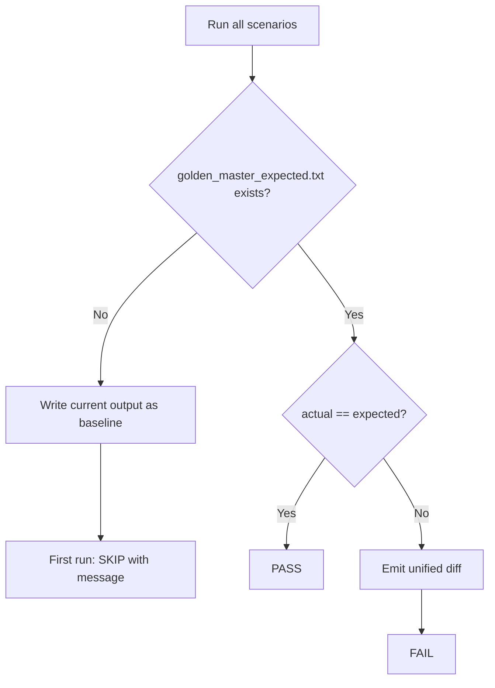

# Golden Master Approval Pattern — Magic Square Solver

## Purpose

Magic Square Solver의 **실제 출력**을 기준선(baseline)으로 고정하고, 이후 변경 시 **회귀(regression)** 를 자동으로 감지합니다. pytest 기반 **Approve Pattern**을 사용합니다.

## Scope

| Scenario | Input source | Expected outcome |
|---|---|---|
| `normal_success` | 4×4 grid, attempt-1 success | `Output: [r1,c1,n1,r2,c2,n2]` |
| `reverse_success` | G2 (attempt-1 fail, attempt-2 success) | `Output: [r1,c1,n1,r2,c2,n2]` |
| `invalid_blank_count` | G0 complete board (0 blanks) | `Error: E_INVALID_BLANK_COUNT` |
| `duplicate_number` | G1 with duplicate non-zero | `Error: E_DUPLICATE_NON_ZERO` |
| `no_valid_solution` | G3 unsolvable board | `Error: UnsolvableDomainError` |

## Output capture strategy

각 시나리오는 Boundary Screen과 동일한 **validate → solve** 흐름을 따릅니다.

1. `BoundaryValidator.validate(grid)` 실행
2. 검증 실패 시 → `Error: <code>` 기록
3. 검증 성공 시 → `solution(grid)` 실행
4. 도메인 실패 시 → `Error: UnsolvableDomainError` 기록
5. 성공 시 → `Output: [r1,c1,n1,r2,c2,n2]` 기록 (1-index 좌표)

stdout 캡처 대신 **Result 직렬화** 방식을 사용합니다. 사람이 읽을 수 있고 diff 비교에 적합합니다.

## Baseline file format

파일: `tests/golden_master_expected.txt`

```text
[normal_success]
Input:
16 2 3 13
5 11 10 8
9 7 0 12
4 14 15 0
Output:
[3,3,6,4,4,1]

________________________________________

[reverse_success]
...
```

- 섹션 헤더: `[scenario_name]`
- 성공: `Input:` + grid rows, `Output:` + `[r1,c1,n1,r2,c2,n2]`
- 실패: `Input:` + grid rows, `Error:` + error code or exception name
- 섹션 구분: `________________________________________`

## Approve pattern flow



### Rules

| Condition | Behavior |
|---|---|
| Baseline **missing** | 현재 출력을 `tests/golden_master_expected.txt`에 **자동 생성** |
| Baseline **exists**, match | 테스트 **PASS** |
| Baseline **exists**, mismatch | **unified diff** 출력 후 **FAIL** |

의도적 출력 변경 시:

```bash
python -m tests.golden_master.generate_golden_master --force
git add tests/golden_master_expected.txt
```

## File layout

| Path | Role |
|---|---|
| `tests/golden_master_expected.txt` | Version-controlled baseline |
| `tests/golden_master/scenarios.py` | Scenario grids + run/serialize logic |
| `tests/golden_master/approve.py` | Approve pattern (read/write/diff) |
| `tests/golden_master/generate_golden_master.py` | CLI baseline generator |
| `tests/test_golden_master_magic_square.py` | pytest regression test (GM-TC-01~05) |

## Running

```bash
# Regression test (approve on first run)
python -m pytest -m golden_master -v

# Explicit baseline generation
python -m tests.golden_master.generate_golden_master --force
```

## Version control

`tests/golden_master_expected.txt`는 **반드시 git에 포함**합니다. Solver·Validator 출력 계약이 바뀌면 baseline을 갱신하고 diff를 리뷰한 뒤 커밋합니다.
